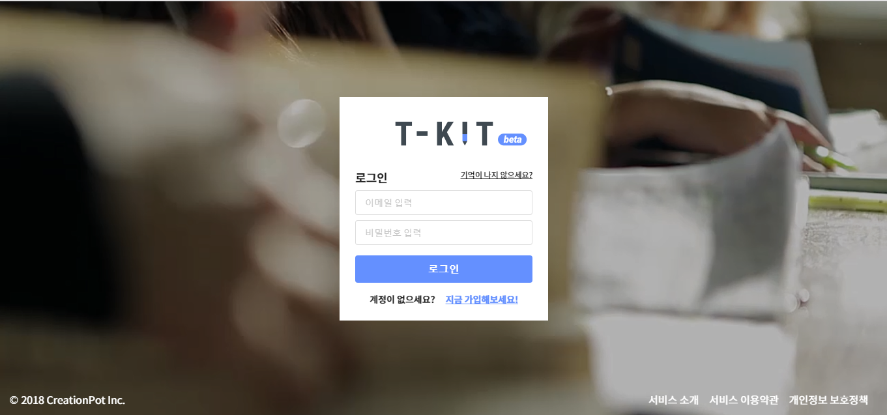

## 프로젝트 소개

자율 학기제의 확대로 인해 선생님들이 교육에 사용할 새로운 교육용 컨텐츠가 필요하게 되었습니다. 그래서 선생님들 마다 각각의 교육 내용에
알맞게 편집할수 있도록 교육용 영상 편집 툴을 개발할 예정입니다.
이 툴을 사용하여 선생님들마다 교육 컨텐츠를 손쉽게 제작 가능하고
제작한 컨텐츠들을 링크 형식으로 학생들에게 배포가 가능하도록
개발할 계획입니다.

### Abstract
T-KIT project is to help teachers that to teach English in middle and high-school. This provides Easy to edit education-video and write exam questions.

### 소개 영상

### 팀소개

이지훈
- server api 개발
- 데이터 보안 관리
 

### 사용 언어
 
 server
 - Java

 client
 - React.js

 DataBase
 - Mysql

